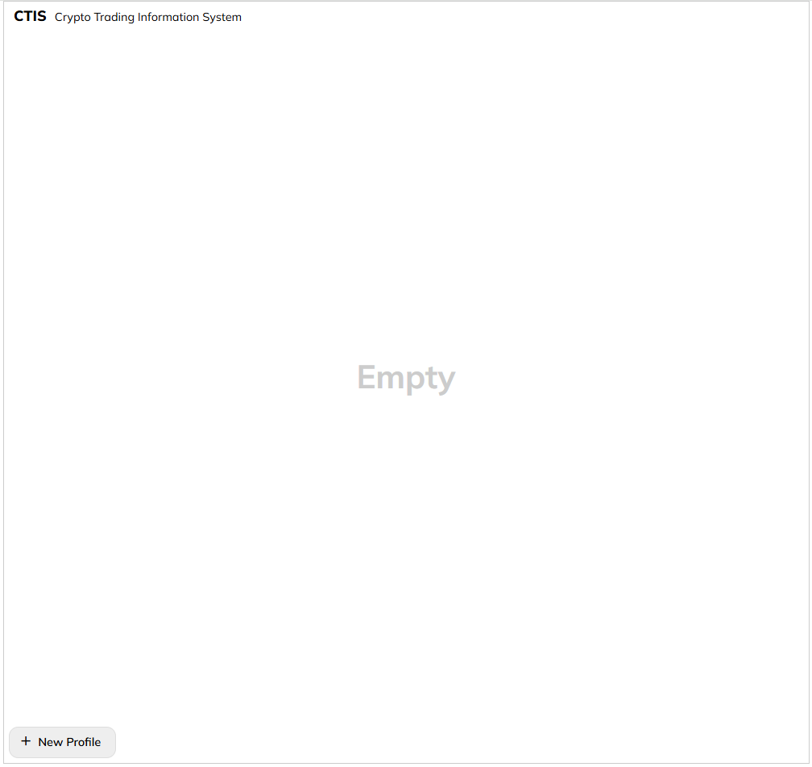
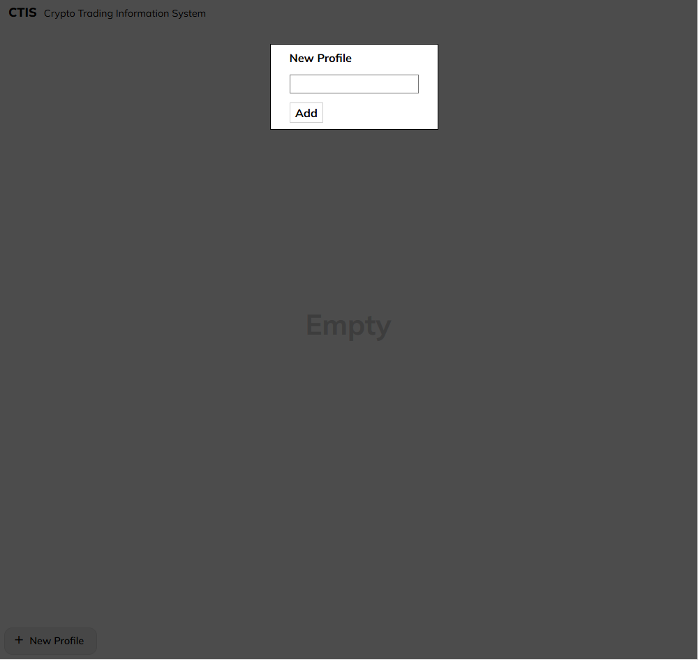
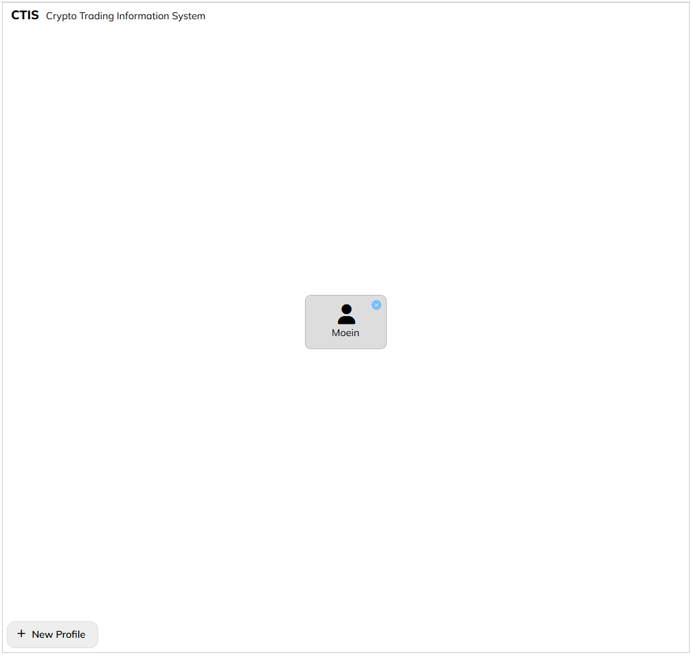
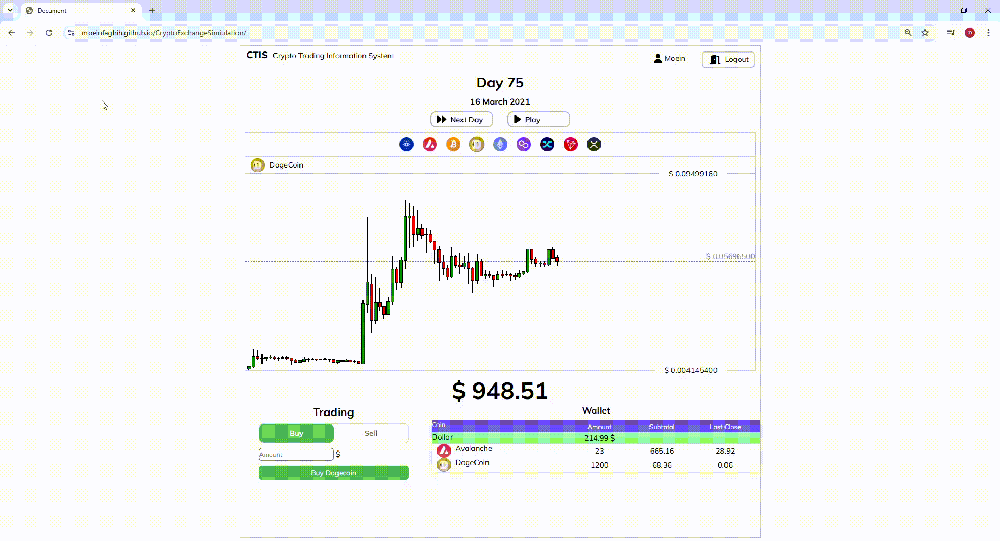

# CTIS Crypto Trading Information System

## 🚀 Overview
CTIS is a **Single Page Application (SPA)** built with **jQuery** that simulates a crypto trading platform. This project features a **custom state management system**, real-time wallet updates, interactive candlestick charts, and an intuitive user experience for trading different cryptocurrencies.

## 🎯 Features

### 🏗️ Dynamic SPA Architecture
- Developed a **single-page application** using **jQuery**, dynamically rendering UI components based on the state.
- Efficiently manages multiple views without requiring full page reloads.

### 🎨 Efficient UI Rendering
- Designed **algorithms to update only modified sections of the page**, minimizing unnecessary DOM updates and boosting performance.
- Implements **optimized rendering logic**, ensuring smooth UI transitions and reactivity.

### 🔄 Custom State Management
- Implemented a **state management system** inspired by React’s `useState`, storing user data persistently with **localStorage**.
- Ensures **data retention between sessions**, allowing seamless user experiences across refreshes.

### 💰 Crypto Trading Simulation
- Users can **buy and sell** cryptocurrencies based on market data.
- **Real-time wallet updates**, reflecting transaction results instantly.
- Implements an **interactive candlestick chart**, visualizing price fluctuations for informed decision-making.

### 🔐 User Authentication Flow
- Allows **profile creation, selection, and deletion** for a personalized experience.
- Displays user-specific wallets, balances, and transaction histories.

## 🛠️ Technologies Used
- **JavaScript (ES6+)**
- **jQuery** for DOM manipulation and event handling
- **HTML & CSS** for UI design
- **LocalStorage** for data persistence

## 📸 Screenshots

## 🔥 Future Improvements
- Implement **real-time market data** from external APIs.
- Introduce **advanced trading strategies** like limit orders.
- Enhance **UI responsiveness** for mobile-friendly experiences.

## 💡 Contributing
Feel free to contribute! Fork the repo, make your changes, and submit a pull request.

## 📜 License
This project is licensed under the MIT License. See the `LICENSE` file for details.

---
**⭐ If you like this project, consider giving it a star!**
